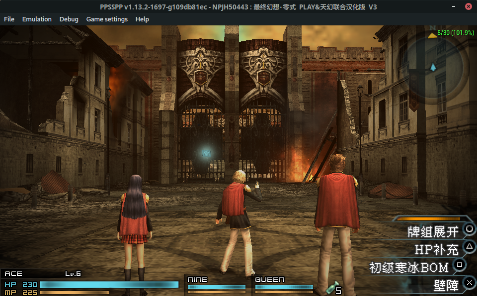

If you want to put a Linux on your TV box to play with, you probably have only one option - Armbian. This is a Debian or Ubuntu based distribution designed especially for ARM devices.

It's far enough if you only want to use as a server. But, if you want to use as a mini desktop machine, things might be different.

The latest version of Ubuntu's desktop experience on the ARM platform can be described as BAD. Starting from 22.04, Ubuntu began to put some essential desktop software into its own Snap store. As we all know, this is a very stupid thing, and it does not work on ARM platform at all. Even the package cannot be installed normally.
As for Debian(Sid), its desktop experience may be **relatively** worse. Besides, not everyone likes Deb-based distributions.

So, here comes this article. Let's install a different distribution!

### Preparation stage
First of all, which distribution do we need to choose? Needless to say that we need a excellent desktop experience, we also need to consider it support situation for the ARM platform, how much softwares are prepared for the ARM platform, and so on.
In addition to Debian-based distributions, Arch-based distributions also supports ARM platforms very well.

We can pick two of the best distros in the Arch system, Arch Linux itself and Manjaro. Their support for ARM is comparable and both are very good.
Here I choose Arch Linux. Of course, I will also mention the installation of Manjaro by the way.
If you are not a skilled user, I would recommend you to choose Manjaro.

The HK1 Box is based on the Amlogic platform, Armbian community no longer supports the Amlogic platform anymore. So first we go to [ophub/amlogic-s9xxx-armbian](https://github.com/ophub/amlogic-s9xxx-armbian/) to download The mirror image of our model is used as the base package.
Go directly to the Release of this project, find the Release item like `Armbian_Aml_jammy_xx.xx.xxxx`, and download the package corresponding to your model. For example, I need to select `Armbian_22.11.0_Aml_s905x3_jammy_5.15.72_server_xxxx.xx.xx.img.gz` for my HK1Box.

After finding the base package, we also need to find the rootfs package of Arch Linux ARM at [offical os mirror](http://mirror.archlinuxarm.org/os/).
If use https, you might face cert error. Don`t worry.

We choose the `Odroid C2` package `ArchLinuxARM-odroid-c2-latest.tar.gz` , the hardware of this device is very similar to our box. This package can be selected for other Amlogic platform devices too.

Manjaro provides images, go directly to https://manjaro.org/download/, scroll down, and you can see Manjaro ARM.
Select `Odroid C4` in the device list, then download an image of the desktop you like, or simply use the one without desktop.

Download the files mentioned above, and everything we need is ready.

### Install the system

Then we need to write the base image to the USB disk(or a SD card) first. If you have [balenaEtcher](https://www.balena.io/etcher/), you can use it to write directly. Otherwise:

```bash
gunzip Armbian_22.11.0_Aml_s905x3_jammy_5.15.72_server_xxxx.xx.xx.img.gz # To unzip the image using gunzip, you need to replace the file name with your own
dd if=Armbian_22.11.0_Aml_s905x3_jammy_5.15.72_server_xxxx.xx.xx.img of=/dev/sdx # To write with dd, you need to replace the filename and device path with your own
```

Then mount the partition named `ROOTFS` on the USB disk(or a SD card), and backup these files or folders:

```
/etc/amlogic_model_database.conf
/etc/fstab
/usr/sbin/armbian-install
/usr/lib/u-boot
/usr/lib/modules
/usr/lib/firmware
```

We still need these files later. Then we need to clear ROOTFS, enter the mount directory and execute:

```bash
sudo rm -rf *
```

Then, here came a different place.
- Arch
- After clearing, extract the downloaded Arch Linux ARM rootfs package to ROOTFS partition.

- Manjaro
- Use software like `kpartx` to mount the image, copy all the contents of `ROOT_MNJRO` partition to ROOTFS partition. You can use `tar` or `rsync` to copy, direct `cp` may cause permission problems.

Then, delete the following files in rootfs:

```
/boot/*
/etc/fstab
/usr/lib/modules
/usr/lib/firmware
```

Let `/boot` to be lefted empty, and replace other three with the corresponding files or folders we just copied from Armbian.
Then copy the other files you just copied from Armbian to the corresponding location.

Next is to modify the startup settings, [ophub/amlogic-s9xxx-armbian](https://github.com/ophub/amlogic-s9xxx-armbian/) has detailed instructions, I will not mention it.

### Enter the system

After completing the above series of operations and configuring the startup settings, we can directly enter the system.
Login with default username `root` and password `root`. (Manjaro's password is not this)
***This is very unsafe, you should modify it immediately after entering the system**

***If you chose Manjaro, You don't need to read the following part. Manjaro's images are all pre-configured. If you chose the image with the desktop, it should go directly to the desktop.**

Before we start to install our own software, we need to execute the following commands:

***The following operations default you have connected to the network normally.**

- Initialize the pacman keyring
```bash
pacman-key --init
pacman-key --populate
```


- Update the current system
```bash
pacman-Syyu
```

- Install some missing important software:
```bash
pacman -S sudo uboot-tools wget git
```

If you want to install the system to emmc, I recommend you install it now:
```bash
pacman -S dosfstools parted && armbian-install
```

With that, an Arch Linux ARM base system is ready. You can install a desktop environment, or whatever else you need. Enjoy!

### Some useful stuff

- Update the kernel
The kernel in the source mirror is definitely not available here, you need to compile one yourself.
How to compile the kernel is explained in [here](https://github.com/ophub/amlogic-s9xxx-armbian/tree/main/compile-kernel), so I won't talk about it.
Like Arch Linux on a normal computer, after installing the kernel, we need to execute `mkinitcpio` to generate the Initrd image, but here, it is not enough.
We need to do this:
```bash
sudo mkinitcpio -g -k (Your kernel version) #Generate Initrd image, standard format. You need to specify your kernel version.
sudo cp /boot/uInitrd /boot/uInitrd-bkp #Backup the current uInitrd image
sudo mkimage -A arm64 -O linux -T ramdisk -C gzip -n uInitrd -d (the location of the generated image) /boot/uInitrd #Convert the newly generated Initrd image to u-Boot format, so that we can boot normally.
```
Then modify the boot settings and point the KERNEL to the new kernel.

---

- AUR
Our dear AUR manager is also fully available on arm platform

paru (Rust): ~~I compiled this thing on my box for 32 MINUTES~~
```bash
git clone https://aur.archlinux.org/paru.git
cd paru
makepkg -si
cd..
rm -rf paru
```
yay (go):
```bash
git clone https://aur.archlinux.org/yay.git
cd git
makepkg -si
cd..
rm -rf yay
```
AUR's support for arm can be basically divided into 3 types
- Generic or on-site download source code compiled, generally can be used without modding PKGBUILD
- Repackage binary, with arm binary provided, generally can be used with a little mod on PKGBUILD
- Repackage binary, and no arm binary provided, no way
- 
When packaging manually, you can use `makepkg -A`. This will ignore architecture requirements, and you will be able to package successfully.

---

- Browser
  
Browsers like Edge and Chrome are only packaged for amd64. You can choose Firefox and Chromium, etc.

Google has long since stopped allowing Chromium to sync Chrome's browsing data, so syncing may be a problem.

Firefox can sync across all platforms, so ~~FIREFOX IS THE GOD~~.

- gAMeING

Mali GPU driver in mainline Linux is called Panfrost. It supports 3D (OpenGL), however, the performance may not be very good.

Running *Final Fantasy: Type-0* with PPSSPPQt, we got around 10 fps (Qt's performance is a bit better than SDL's). It doesn't really feel that laggy, barely playable.



Knowing that *Final Fantasy: Type-0* is one of the more stressful 3D games on the PSP, I would expect it to run this way. All in all, the more stressful 3D games of the PSP era should be the uplimit of this HK1 Box under mainline kernel.

As for PSP 2D games or lighter 3D games, NDS games or earlier games ~~(PS2 doesn't count)~~ can basically handle it easily.

(PPSSPP can be packaged directly from AUR, **not recommended to compile on the box, otherwise you will deeply appreciate what "SLOW" means.**)

Later I will try some native Linux games.

- Video decoding

With mainline kernel, video hard decoding capability is almost non-existent. Only mpv can *somehow* call hard decoding (meaning lower CPU usage).

You should go to the Android or Coreelec to watch your videos.


### Working
~~You may not know this, but the Grub bootloader supports aarch64, and with btrfs subvolumes and U-Boot's EFI mode, it's maybe possible to multi boot?~~.